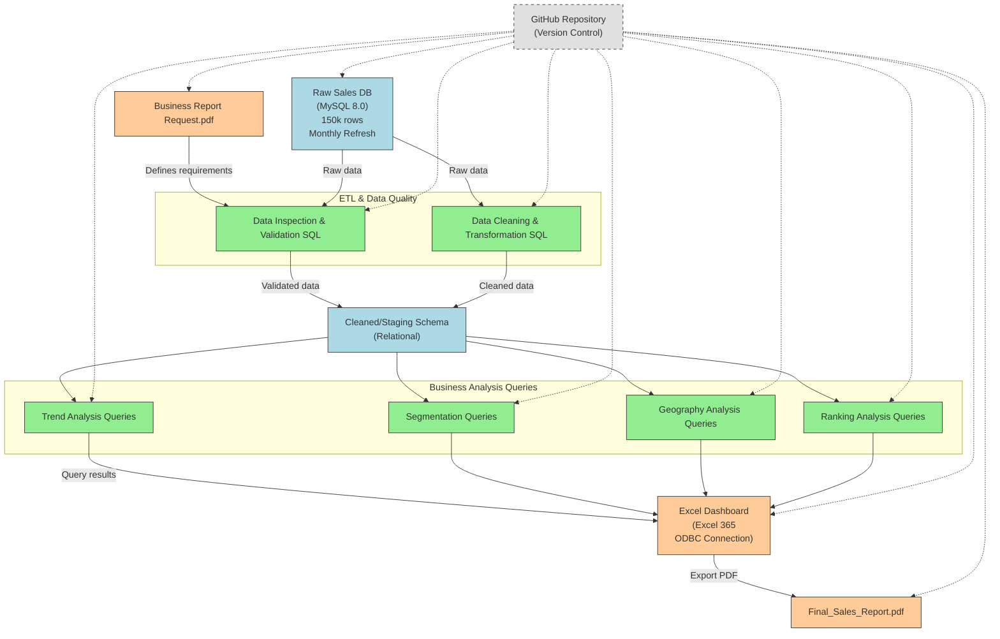

# Project Background
British Shoppers established in 2024, is mainly a mid-size retail company that specialises in selling products such as electronics, sports, home goods, clothing and beauty accessories. Their products are sold online and in physical stores. 

The company has significant amount of data on it sales, marketing efforts, operational efficiency, and customer segmentation program that has been underutilised. This project thoroughly analyzes and synthesizes
this data to uncover critical insights that will improve British Shoppers' commercial success. 

Insights and recommendations are provided on the following key areas:
- Sales Trend Analysis    
- Customer Segmentation Analysis 
- Sales by location   
- Performance Ranking of Products  

The business report request can be found [here](https://github.com/OtKwesi/SalesAnalytics_BritainShoppers/blob/b58922b3fc808c211e38333b5bcdf1ce14fd0b62/Business%20Report%20Request.pdf).    
Full report answering the business questions can be found [here](https://github.com/OtKwesi/SalesAnalytics_BritainShoppers/blob/5a5a407c9a9db5439f9d96b0217488a72a55f23d/Final%20_Sales%20_Report.pdf).    
An interactive Excel dashboard can be downloaded [here](https://github.com/OtKwesi/SalesAnalytics_BritainShoppers/blob/2479ff793efda6ba97eef6637eaa754a36833a65/Sales_Dashboard.xlsx).    
The SQL queries utilised to inspect and perform quality checks can be found [here](https://github.com/OtKwesi/SalesAnalytics_BritainShoppers/blob/48a71fcac7b70b1c54e678200be5c85f16934bd1/SQL_Data_Inspection_and_Validation_Checks.pdf).    
The SQL queries utilised to clean, organise and prepare data for the dashboard can be found [here](https://github.com/OtKwesi/SalesAnalytics_BritainShoppers/blob/496dfd06733417c31896a589de1dc1203e30cbec/SQL_Data_Cleaning.pdf).   
Targeted SQL queries regarding various business questions can be found [here](https://github.com/OtKwesi/SalesAnalytics_BritainShoppers/blob/4927e29b299aa9b64df5e7c7f236f7ed53851da2/SQL_Business_Analysis_Queries.pdf).    

## 🔁 Data and Sales Analytics Pipeline Overview
This presents an end-to-end sales analytics solution for a UK retail dataset. It showcases everything from data sourcing and cleaning to analysis and dashboarding, all version-controlled and documented.

# Data Structure and Initial Checks
Bristish Shoppers database structure as seen below consists of seven tables: sales, products,categories, customers, regions, sales_representatives and payment_methods with a total row count of 150 records.  
Here is a snapshot of the dashboard created for this project:
.jpg)
Prior to beginning the analysis, a variety of checks were conducted for data quality and validation and familiarisation of the datasets. The SQL queries
utilised to inspect and perform quality check can be found [here](https://github.com/OtKwesi/SalesAnalytics_BritainShoppers/blob/748acc61a4378564ef3fe4583bc10460aa08c288/SQL_Data_Inspection_and_Validation_Checks.pdf).

# Executive Summary  
**Overview of Findings**    

In FY 2024, British Shoppers Retail Outlets earned **£159,771** in revenue, with **Q3** accounting for almost one-third of yearly sales averaging monthly sales of **£13,314** making it a strategic significance contributor. **September** recorded the highest revenue for the month **(£25,249)**, whereas **February and November underperformed** significantly.
Sales from new, regular, and VIP customers were almost evenly divided, though all three segments witnessed **high cancellation order rates of 28%** that created retention threats.
Geographically, **London** had preponderant sales (£51.4k) and also had high fulfilment of orders. Manchester was well behind with only £20.7k of contribution.
Overall order fulfillment at 47% fell short of industry norms, 25% cancellations, and 28% pending orders indicate systemic operational inefficiencies.
While there was a **healthy profit margin (37.6%)**, key changes are necessary in logistics, customer experience, and geographic strategy to unlock more than £1M+ of revenue opportunity.

Below is the overview page from the Excel dashboard and more examples are included throughout the report. The entire interactive dashboard can be downloaded [here](https://github.com/OtKwesi/SalesAnalytics_BritainShoppers/blob/2479ff793efda6ba97eef6637eaa754a36833a65/Sales_Dashboard.xlsx).    

.

# Findings
**Sales Trend Analysis:**  
  
- **September Peak:** Total sales peaked in September 2024 with **£25,249** in revenue. This significant uptick aligns with seasonal purchasing trends, potentially driven by early holiday shopping.  
- **Post-Holiday Slump:** Sales dropped sharply in February, hitting a yearly **low of £8,639**. This post-holiday slump reflects a common seasonal pattern, where consumer spending declines after strong January spending.  
- **Spring Recovery:** A gradual recovery was observed from **March to April**, with April recording £17,026 in revenue. This improvement suggests increased purchasing activity during the spring, possibly linked to promotional campaigns or product launches.
- **Mid-Year Dip:** Sales remained relatively **stable from May through August**, fluctuating between £11,942 and £14,653. These months represent a plateau in performance, indicating steady but unspectacular consumer activity during mid-year.
- **Late-Year Underperformance:** **October through December showed lower performance**, with November recording the lowest monthly total of £6,966. Despite seasonal expectations, late-year sales underperformed, possibly due to shifting consumer behaviour or lower promotional effectiveness.

  

**Sales by Location:**  

- **London** led with **£51,366** in sales (32.2% of total) and £21,181 profit, but a high 26% order cancellation rate indicates significant fulfilment challenges.
- **Oxford** generated £46,325 in sales but **underperformed relative to its affluent market** potential, suggesting operational inefficiencies that need to be addressed.
- **Leeds** achieved **£41,366** in sales with moderate performance, presenting an **opportunity to optimize inventory**, especially in sports and home goods categories.
- **Manchester** significantly **underperformed with £20,714** in sales (average £6.7k), requiring a root-cause analysis focusing on factors like foot traffic and local competition.  

**Customer Segmentation Analysis:**    

- **New Customers**: Electronics, sports, and beauty lead sales; clothing underperforms. London generates nearly half of new customer revenue, while Oxford remains underdeveloped. A 20% cancellation rate signals fulfilment risks impacting retention.
- **Regular Customers**: Home goods and sports categories are strong; clothing lags. Manchester’s low sales and a high 28% cancellation rate reveal loyalty and operational challenges. October’s revenue dip suggests a need for off-peak promotions.
- **VIP Customers**: Sports and home goods dominate spend, but beauty underperforms despite premium potential. Leeds and Oxford lead in VIP revenue, yet a 26% cancellation rate and 30% pending orders threaten high-value relationships.
  
**Performance Ranking of Products:**  

- **Sports** led all categories with **£44,989** in revenue, demonstrating strong appeal across customer segments. Bundling strategies are recommended to further boost average order value and retention.  
- **Home Goods** generated **£41,024**, with stable and geographically diverse demand. Expanding the product range in top-performing regions could help capture additional market share.  
- **Beauty cateogry** achieved moderate results with **£31,414** in revenue. Growth can be stimulated through loyalty programs and price sensitivity testing.  
- **Electronics** earned **£29,233**, maintaining a steady mid-tier sales position. Leveraging influencer partnerships and aligning promotions with seasonal trends could drive higher visibility and conversions.
- **Clothing** underperformed at **£13,110**, signalling the need for strategic changes. A/B testing of assortments, pricing, and promotions is advised to identify opportunities for improvement.

# Recommendations
  
- Reduce cancellations by 15% in Q1 via automated inventory alerts and expedited shipping options while relocating 20% of Manchester's budget to London or Leeds for higher ROI.
- Launching clothing promotions (e.g. Buy 1, Get 1 Half Price) tied to sports purchases and introduce VIP-exclusive beauty bundles to boost low-performing categories.
- Audit Oxford's fulfillment processes and lease terms to align with sales potential and pilot a pop-up store in Manchester with localised assortments to test demand.
- Roll out quarterly 360-degree evaluations to align coaching with performance gaps for sales rep and reward top performers with leadership roles in cross-regional strategy sessions.
